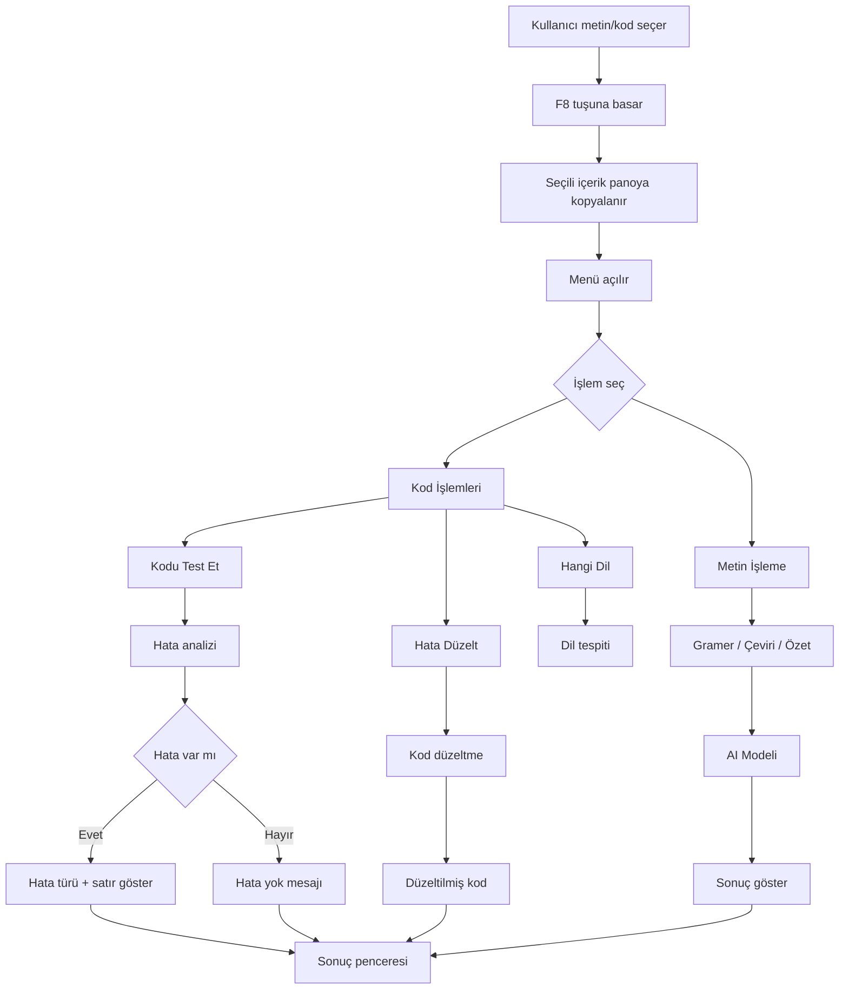

# 🚀 AI Destekli Metin ve Kod Analiz Asistanı

Bu proje, seçilen metin veya kod üzerinde **tek tuş (F8)** ile hızlı işlemler yapmanı sağlayan bir masaüstü uygulamasıdır.  
Amaç: Metin işlemlerini kolaylaştırmak ve yazılımcılar için **hızlı kod analiz & düzeltme** aracı sunmak.

---

## 🎯 Ne İşe Yarar?

- Metinleri hızlıca düzenler (çeviri, özet, gramer)
- Kodun hangi dilde olduğunu anlar
- Kodda hata olup olmadığını söyler
- Hatalı kodu **otomatik düzeltir**

---

## ⚙️ Özellikler

### 📝 Metin İşleme
- 📝 Gramer Düzelt
- 🇬🇧 İngilizceye Çevir
- 🇹🇷 Türkçeye Çevir
- 📑 Özetle (Madde Madde)
- 💼 Daha Resmi Yap
- 🐍 Python Koduna Çevir
- 📧 Cevap Yaz (Mail)
- 🎮 PS5 Oyun Skor + Acımasız Yorum

---

### 💻 Kod İşlemleri

#### 🔎 Hangi Dil
Seçilen kodun dilini tespit eder  
(Python, C, C++, C#, Java, JS, HTML, CSS)

#### 🧪 Kodu Test Et
- Hata varsa: türünü ve satırını gösterir  
- Hata yoksa: bilgi verir  

#### 🛠️ Hata Düzelt
- Koddaki hataları düzeltir  
- **Düzeltilmiş tam kodu** verir  

---

## 🧠 Nasıl Kullanılır?

1. Metin veya kod seç  
2. **F8 tuşuna bas**  
3. Menüden işlem seç  
4. Sonucu gör  

---

## ⚙️ Kurulum

### Gereksinimler
- Python 3.8+
- Ollama

### Kurulum

```bash
pip install -r requirements.txt
```

### Ollama İçin

```bash
ollama pull llama3.2
ollama serve
```

### Çalıştırma

```bash
python main.pyw
```

---

## 📊 Proje Akış Diyagramı



---

## 📌 Örnek Kullanımlar

Aşağıdaki örnekler, uygulamanın 3 temel fonksiyonunun nasıl çalıştığını gösterir:

- 🔎 **Hangi Dil**
- 🧪 **Kodu Test Et**
- 🛠️ **Hata Düzelt**

Her dil için hem **doğru** hem de **hatalı** kod ve beklenen çıktılar verilmiştir.

---

### 🐍 Python

#### ✅ Doğru Kod
```python
def topla(a, b):
    return a + b

print(topla(2, 3))
```

#### Beklenen Çıktı:

- Hangi Dil → Python
- Kodu Test Et → Hata yok
- Hata Düzelt → Aynı kod

#### ❌ Hatalı Kod
```python
def topla(a, b)
    return a + b

print(topla(2, 3))
```

#### Beklenen Çıktı:

- Hangi Dil → Python
- Kodu Test Et → Syntax Hatası
- Hata Düzelt →

```python
def topla(a, b):
    return a + b

print(topla(2, 3))
```

### 💻 C
#### ✅ Doğru Kod

```c
#include <stdio.h>

int main() {
    printf("Merhaba\n");
    return 0;
}
```

#### Beklenen Çıktı:

- Hangi Dil → C
- Kodu Test Et → Hata yok
- Hata Düzelt → Aynı kod

#### ❌ Hatalı Kod

```c
#include <stdio.h>

int main() {
    printf("Merhaba\n")
    return 0;
}
```

#### Beklenen Çıktı:

- Hangi Dil → C
- Kodu Test Et → Noktalı Virgül Hatası
- Hata Düzelt →

```c
#include <stdio.h>

int main() {
    printf("Merhaba\n");
    return 0;
}
```

### 💠 C#
#### ✅ Doğru Kod

```c#
using System;

class Program {
    static void Main(string[] args) {
        Console.WriteLine("Merhaba");
    }
}
```

#### Beklenen Çıktı:

- Hangi Dil → C#
- Kodu Test Et → Hata yok
- Hata Düzelt → Aynı kod

#### ❌ Hatalı Kod

```c#
using System;

class Program {
    static void Main(string[] args) {
        Console.WriteLi("Merhaba");
    }
}
```

#### Beklenen Çıktı:

- Hangi Dil → C#
- Kodu Test Et → Metot Adı Hatası
- Hata Düzelt →

```c#
using System;

class Program {
    static void Main(string[] args) {
        Console.WriteLine("Merhaba");
    }
}
```

### ☕ Java
#### ✅ Doğru Kod

```java
public class Main {
    public static void main(String[] args) {
        System.out.println("Merhaba");
    }
}
```

#### Beklenen Çıktı:

- Hangi Dil → Java
- Kodu Test Et → Hata yok
- Hata Düzelt → Aynı kod

#### ❌ Hatalı Kod
```java
public class Main {
    public static void main(String[] args) {
        System.out.printLn("Merhaba");
    }
}
```

#### Beklenen Çıktı:

- Hangi Dil → Java
- Kodu Test Et → Büyük/Küçük Harf Hatası
- Hata Düzelt →

```java
public class Main {
    public static void main(String[] args) {
        System.out.println("Merhaba");
    }
}
```

### 🌐 JavaScript
#### ✅ Doğru Kod

```js
function selamVer() {
    console.log("Merhaba");
}

selamVer();
```

#### Beklenen Çıktı:

- Hangi Dil → JavaScript
- Kodu Test Et → Hata yok
- Hata Düzelt → Aynı kod

#### ❌ Hatalı Kod

```js
function selamVer() {
    Console.WriteLine("Merhaba");
}

selamVer();
```

#### Beklenen Çıktı:

- Hangi Dil → JavaScript
- Kodu Test Et → Yanlış Dil Komutu Hatası
- Hata Düzelt →

```js
function selamVer() {
    console.log("Merhaba");
}

selamVer();
```

---

## 📁 Proje Yapısı

```text
Introduction-to-Data-Visualization-Project-Assignment/
│
├── main.pyw            # Ana uygulama (GUI + tüm işlem mantığı)
├── README.md           # Proje dokümantasyonu
├── requirements.txt    # Gerekli Python kütüphaneleri
├── BASLAT.bat          # Windows için hızlı başlatma scripti
├── kurulum.bat         # Otomatik kurulum scripti
│
├── .venv/              # Sanal ortam (virtual environment)
├── __pycache__/        # Python cache dosyaları
│
└── .gitattributes      # Git ayarları
```

### 📌 Açıklamalar
- main.pyw:
Uygulamanın ana dosyasıdır. F8 işlemleri ve tüm mantık burada bulunur.
- requirements.txt:
Gerekli Python kütüphanelerini içerir.
- BASLAT.bat / kurulum.bat:
Windows için kolay kurulum ve çalıştırma sağlar.
- .venv/:
Sanal ortam klasörüdür.
- pycache/:
Python tarafından otomatik oluşturulur.